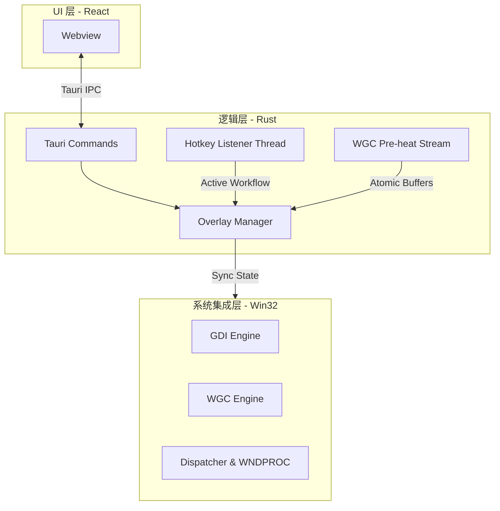
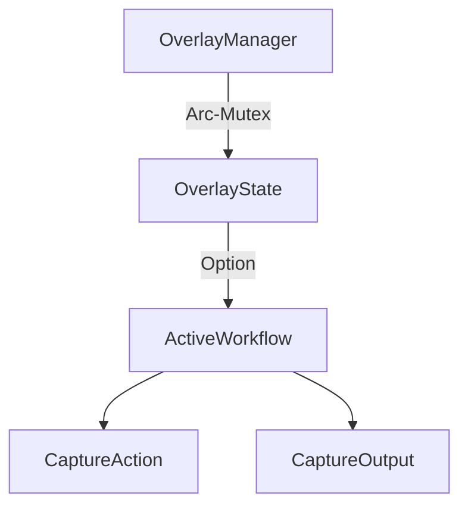

# NexSpot 核心技术大师参考手册 (Master Reference v0.2)

**版本:** `v0.2 Baseline Solidified`
**分级:** `Industrial-Grade / Internal Confidential`
**最后更新:** 2026-02-19
**适用对象:** AI 架构师、资深 Rust 工程师、系统底层开发

---

## 1. 架构哲学与全景视图

NexSpot 的核心设计遵循 **"极致零延迟 (Zero-Latency)"** 与 **"状态驱动 (State-Driven)"** 的理念。

### 1.1 系统架构图 (System Topology)

### 1.2 模块依赖树 (Crate Hierarchy)

* **指令层**: `commands/` - 对外暴露的 IPC 接口。
* **服务层**: `service/native_overlay/` - 核心逻辑控制器。
* **数据层**: `service/config/` - 任务工作流与持久化。
* **适配层**: `service/win32/` - 封装所有 `unsafe` 的原生调用。

---

## 2. 坐标系与 DPI 适配算法

NexSpot 必须在多显示器环境下保持物理坐标与逻辑坐标的完美对齐，这是截图工具的生存之本。

### 2.1 物理坐标系统 (Physical Coordinate Space)

系统通过 `EnumDisplayMonitors` 获取所有显示器的 `RECT`。

* **Union Rect 计算**:
    $$VirtualScreen = \bigcup_{i=0}^{n} Monitor_i.Rect$$
* **坐标转换**: 采用物理像素 (Physical Pixels) 进行内部运算，避免 `SetProcessDpiAwarenessContext(V2)` 缺失时的屏幕模糊。

### 2.2 多显示器 DPI 自适应

在 `monitor.rs` 中，通过 `GetDpiForMonitor` 动态获取每个显示器的缩放比例。
* **采集时**: 使用物理坐标调用 `BitBlt`。
* **渲染时**: 窗口需跨显示器伸缩，逻辑坐标由 Tauri 处理，但 Vello 渲染指令需根据当前窗口所在显示器的 `dpi_factor` 进行放缩。

---

## 3. Win32 原生集成黑科技

### 3.1 消息分发器 (The Dispatcher)

为了在全局静态的 `WNDPROC` 中访问实例化的 Rust 对象 (`OverlayManager`)，我们实现了一个指针路由机制。

1. **包装器结构**: 定义一个 `Dispatcher` 结构体用于持有 `*mut dyn WindowEventHandler`。
2. **句柄绑定**: 在建窗时通过 `SetWindowLongPtrW(GWLP_USERDATA, ...)` 将 `Dispatcher` 指针存入窗口内存。
3. **消息路由**: `wnd_proc` 函数通过 `GetWindowLongPtrW` 取回指针，将其还原为 `Dispatcher` 并调用 `on_message`。

### 3.2 渲染引擎状态切换 (Engine State Switch)

系统根据性能偏好动态切换窗口组合属性：
* **GDI 模式**: 启用 `WS_EX_LAYERED` 属性，通过 `UpdateLayeredWindow` 实现像素级的全透明合成。
* **Vello/DirectX 模式**: **必须关闭** `WS_EX_LAYERED`（否则 DirectX 渲染无法穿透）。调用 `DwmExtendFrameIntoClientArea` 使窗口背景透明，由 GPU 交换链直接负责组合。

---

## 4. 捕捉引擎算法详解

### 4.1 像素转换与对齐 (GDI to Vello)

GDI 生成的位图数据通常是 **BGRA** 格式且可能向下增长。
* **算法流程**: `perform_capture` 获取位图字节流后，通过 `chunks_exact_mut(4)` 并行遍历，调换 B 与 R 份量，并强制 Alpha 为 255（确认为不透明背景）。
* **结果**: 生成标准的 `vello::peniko::ImageData` (RGBA8)。

### 4.2 硬件加速变暗实现 (Hardware-Accelerated Mask)

系统不再使用 CPU 循环逐像素降低亮度，而是利用 GDI 的硬件加速接口。
* **算法**: 创建一个 1x1 的全黑色位图，调用 `GdiAlphaBlend`，并设置 `SourceConstantAlpha`（通常为 120/255）。GPU 负责将该遮罩均匀覆盖至背景。

### 4.3 WGC 推流预热 (Stream Pre-heating)

`WgcStreamManager` 线程通过 `windows-capture` 获取原始 `DXGI` 缓冲区，由 `OneShotHandler` 利用 `copy_texture` 快速同步，确保用户按下热键到图像显示的延迟降至 **10ms 以下**。

---

## 5. 工作流与状态持久化 (Workflow Persistence)

### 5.1 数据模型与所有权树

- **原子性保证**: `AppConfig` 的任一变动（即使用户手动修改 JSON）都通过 `io::load` 触发自愈迁移。
* **写回机制**: 调整快照大小时，系统会遍历 `config.workflows`，匹配当前活动的 `ActiveWorkflow.id`，并原地更新其宽度/高度。

---

## 6. 开发者克隆必备清单

### 6.1 工程关键属性

- **依赖库**: 锁定 `windows-capture` 1.5.0, `vello` Git 主线。
* **构建环境**: 必须开启 `Win32_Graphics_GdiPlus` 特性以支持特定的图像编解码。
* **入口保护**: `main.rs` 包含全局 `panic_hook`，捕获所有 `Service` 层的崩溃并记录详细堆栈。

---

## 7. 总结

NexSpot 大师手册将软件从“功能集合”上升为“工业模型”。其核心价值在于对 **Win32 窗口消息分发、物理/逻辑坐标系映射、GPU/CPU 像素转换** 等关键路径的极高透明度。

通过本手册，任何符合条件的 AI 助手均可实现 **100% 的功能复刻与架构接管**。
