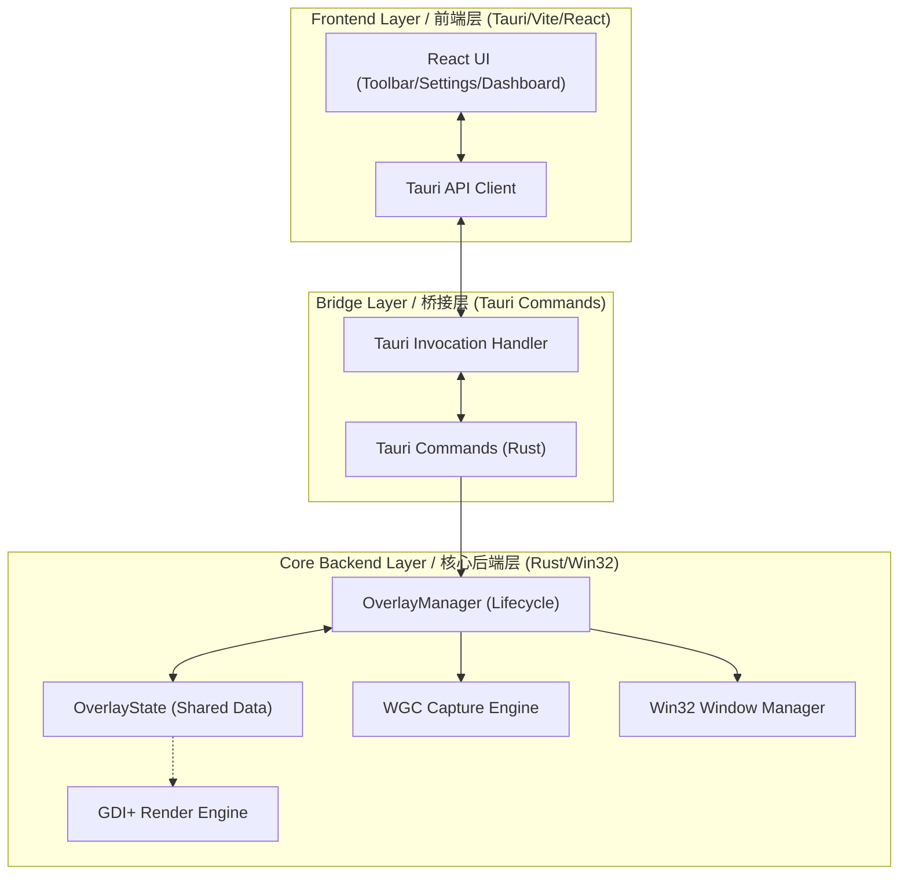
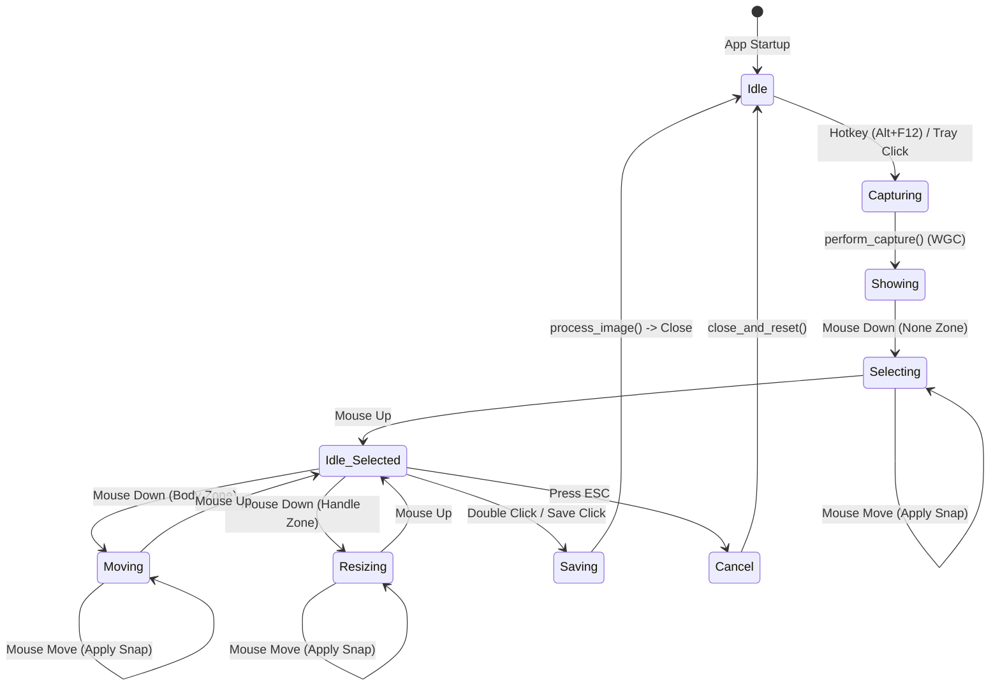

# NexSpot: 项目架构全景图 (Project Architecture Panorama)

NexSpot is a high-performance, modular screenshot engine designed for Windows. Its core design philosophy is **"Native Performance meets Web Flexibility"**.
NexSpot 是一款专为 Windows 打造的高性能、模块化截图引擎。其核心设计理念是 **“原生性能与 Web 灵活性并重”**。

## 1. 总体架构分层 (System Architecture Layers)

The architecture of NexSpot is divided into three main layers, collaborating through state sharing and command passing.
NexSpot 的架构分为三个主要层级，通过状态共享与指令传递进行协作。



---

## 2. 模块结构 (Module Tree)

The following is the physical code structure of the NexSpot Rust side (based on `tree /f`):
以下是 NexSpot Rust 侧的物理代码结构（基于 `tree /f`）：

```text
F:\MY_AI\NEXSPOT\SRC-TAURI\SRC
│  lib.rs                  # App Entry, Tauri Commands / 应用程序入口、Tauri 命令
│  main.rs                 # Bootstrapper / 引导程序
│
└─service
    │  logger.rs           # Unified Logging / 统一日志服务
    │  mod.rs
    │  shortcut_manager.rs # Global Hotkey Management / 全局热键管理
    │
    ├─native_overlay       # Screenshot Core Logic / 截图核心逻辑 (Native Overlay)
    │  │  capture.rs       # Capture Pipeline (WGC) / 屏幕捕捉管线 (WGC)
    │  │  interaction.rs   # Input Translator (Mouse/Touch) / 输入转换器 (Mouse/Touch Logic)
    │  │  magnifier.rs     # Real-time Magnifier / 实时放大镜组件
    │  │  mod.rs           # Selection Manager (OverlayManager) / 选区管理器 (OverlayManager)
    │  │  save.rs          # Clipboard/File Persistence / 剪贴板/文件持久化
    │  │  snapping.rs      # Geometric Snapping Algorithm / 几何吸附算法
    │  │  state.rs         # Unified State Definition / 统一状态定义
    │  │  toolbar.rs       # Floating Toolbar Positioning / 悬浮工具栏定位
    │  │
    │  └─render            # Native GDI Rendering / 原生 GDI 渲染模块
    │          mod.rs
    │
    └─win32                # Windows OS Adaptation Layer / Windows OS 深度适配层
            bitmap.rs      # Bitmap Utilities / 位图处理工具
            gdi.rs         # GDI+ RAII Wrappers / GDI+ 对象封装 (RAII)
            mod.rs
            monitor.rs     # Multi-monitor & DPI / 多显示器 DPI 适配
            send_sync.rs   # Win32 Handle Wrappers / Win32 句柄跨线程包装
            window.rs      # Layered Window Management / 原生分层窗口管理
```

---

## 3. 核心 `OverlayState` 定义 (Core OverlayState Definition)

`OverlayState` is the "Single Source of Truth" (SSOT) for NexSpot. It is stored in an `Arc<Mutex<OverlayState>>` to ensure consistency between rendering and interaction.
`OverlayState` 是 NexSpot 的“单一事实来源”(SSOT)。它存储在 `Arc<Mutex<OverlayState>>` 中，保证了渲染与交互的一致性。

```rust
// src-tauri/src/service/native_overlay/state.rs

pub struct OverlayState {
    pub is_visible: bool,           // Whether the overlay is active / 覆盖层是否处于激活显示状态
    pub x: i32,                     // Overlay X relative to virtual desktop / 覆盖层相对于虚拟桌面的 X 坐标
    pub y: i32,                     // Overlay Y relative to virtual desktop / 覆盖层相对于虚拟桌面的 Y 坐标
    pub mouse_x: i32,               // Local mouse X inside overlay / 当前鼠标在覆盖层内的 X 坐标 (Local)
    pub mouse_y: i32,               // Local mouse Y inside overlay / 当前鼠标在覆盖层内的 Y 坐标 (Local)
    pub selection: Option<RECT>,    // Current selection rect / 当前用户的选区矩形
    pub interaction_mode: InteractionMode, // Interaction mode / 交互模式: Selecting | Moving | Resizing | None
    pub hover_zone: HitZone,        // Mouse hover zone / 鼠标感应区域 (8个控制点、主体或空)

    // State variables used during dragging / 拖拽过程中使用的状态变量
    pub start_x: i32,               // Initial mouse position on interaction / 交互开始时的初始鼠标位置
    pub start_y: i32,
    pub drag_start_selection: Option<RECT>, // Original selection on interaction / 交互开始时的原始选区

    pub width: i32,                 // Total width of the overlay / 覆盖层的完整宽度
    pub height: i32,                // Total height of the overlay / 覆盖层的完整高度

    pub hbitmap_dim: Option<SafeHBITMAP>,    // Dimmed background bitmap / 当前屏幕的暗化底图
    pub hbitmap_bright: Option<SafeHBITMAP>, // Original bright bitmap / 当前屏幕的原始明亮大图
    pub window_rects: Vec<RECT>,             // Visible window bounds for snapping / 场景内所有可见窗口的包围盒 (用于吸附)
}
```

---

## 4. 状态流转逻辑 (State Flow)

The life cycle of NexSpot is triggered by hotkeys, goes through selection interactions, and ends with save or cancel.
NexSpot 的生命周期由热键触发，经过选区交互，最后以保存或取消结束。



---

## 5. 核心技术路径 (Key Technical Paths / 核心技术路径)

1. **Zero-Latency Display**: Achieved real-time rendering synchronization using Win32 `SetWindowPos` and `UpdateLayeredWindow`, bypassing the Webview rendering pipeline.
   **零延迟显示**: 使用 Win32 `SetWindowPos` 配合 `UpdateLayeredWindow` 实现全平台渲染同步，绕过 Webview 渲染管道以消除延迟。
2. **Magnetic Snapping**: Used `DwmGetWindowAttribute` to obtain accurate visual boundaries (excluding shadows) and performed real-time coordinate calibration in `InteractionHandler`.
   **智能磁吸**: 调用 `DwmGetWindowAttribute` 获取精确的视觉边界（排除阴影），在 `InteractionHandler` 中实时进行坐标校准。
3. **Hybrid Rendering**: The screenshot layer is entirely driven by the underlying GDI (Rust), while complex settings interfaces and toolbar interactions remain as Webview (React), achieving a perfect balance of performance and visual effects.
   **混合渲染**: 截图层完全由底层 GDI 驱动（Rust），而复杂的设置界面和工具栏交互保持为 Webview（React），实现了性能与特效的最佳平衡。
